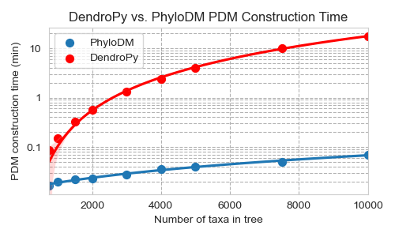
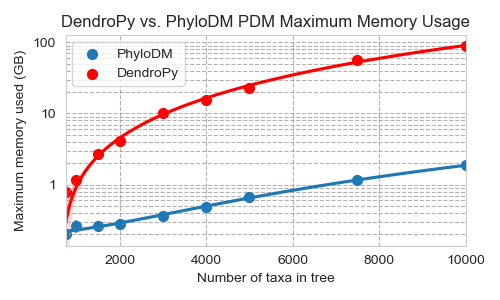

# PhyloDm
[](https://pypi.org/project/phylodm/)
[](https://codecov.io/github/aaronmussig/PhyloDM?branch=master)

Efficient calculation of pairwise phylogenetic distance matrices.

## Installation
* PyPI: `pip install phylodm`

## Usage
The leaf nodes in the tree must have unique names, otherwise a `DuplicateIndex` exception is raised.

### Python library

#### Creating a phylogenetic distance matrix
A phylogenetic distance matrix (`PDM`) object can be created from either a DendroPy tree, or a
newick file:

```python
import dendropy
from phylodm.pdm import PDM

# Load from DendroPy
t = dendropy.Tree.get_from_string('(A:4,(B:3,C:4):1);', 'newick')
pdm = PDM.get_from_dendropy(tree=t, method='pd')

# Load from Newick
with open('/tmp/newick.tree', 'w') as fh:
    fh.write('(A:4,(B:3,C:4):1);')
pdm = PDM.get_from_newick_file('/tmp/newick.tree', method='pd')
```

Once created, a `PDM` can be cached to disk, where it can be later loaded:

```python
import dendropy
from phylodm.pdm import PDM

# Create a PDM.
t = dendropy.Tree.get_from_string('(A:4,(B:3,C:4):1);', 'newick')
pdm_a = PDM.get_from_dendropy(tree=t, method='pd')

# Write to cache.
pdm_a.save_to_path('/tmp/pdm.mat')

# Load from cache.
pdm_b = PDM.get_from_path('/tmp/pdm.mat')
```

#### Accessing data
The `PDM.as_matrix` method generates a symmetrical numpy distance matrix and returns a tuple of
keys in the matrix row/column order:
```python
import dendropy
from phylodm.pdm import PDM

# Load from DendroPy
t = dendropy.Tree.get_from_string('(A:4,(B:3,C:4):1);', 'newick')
pdm = PDM.get_from_dendropy(tree=t, method='pd')
labels, mat = pdm.as_matrix(normalised=False)
"""
/------------[4]------------ A
+
|          /---------[3]--------- B
\---[1]---+
           \------------[4]------------- C
           
labels = ('A', 'B', 'C')
mat = [[0. 8. 9.]
       [8. 0. 7.]
       [9. 7. 0.]]
"""

# Retrieving a specific value
pdm.get_value('A', 'A')  # 0
pdm.get_value('A', 'C')  # 9
pdm.get_value('C', 'A')  # 9
```

#### Method
The method parameter can be either patristic distance (`pd`) or the count of edges between 
leaves (`node`).

#### Normalisation
If true, the data will be returned as normalised depending on the method:
* `pd` = sum of all edges
* `node` = count of all edges

### CLI
The CLI can be used to create a phylogenetic distance matrix given a newick tree, e.g.:
 
`python -m phylodm /path/to/newick.tree pd /path/to/matrix.mat`

## Performance
Tests were executed using the `scripts/perf_test/collect_data.py` script on dual AMD EPYC 7402 
CPUs with 10 trials.

These tests demonstrate that PhyloDM is more efficient than DendroPy's
phylogenetic distance matrix when there are over 500 taxa in the tree. If there
are less than 500 taxa, then use DendroPy for all of the great 
features it provides. 


